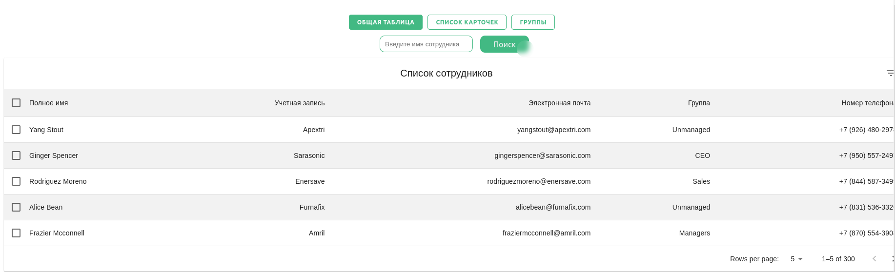

# О проекте

Подсказка: для корректного отображения данных приложения, 
нужно локально запустить сервер для отдачи данных. Запуск производится командой 

```npm run server```

Приложение поддерживает насколько страниц:

1) Страница приветствия
2) Главная страница



На главной странице для работы доступно несколько режимов отображения:

1) Представление в виде таблицы
2) Представление в виде списка карточек
3) Представление с сортировкой по отделам

Также в приложении доступен поиск сотрудников

Также доступно удаление и добавление новых записей
